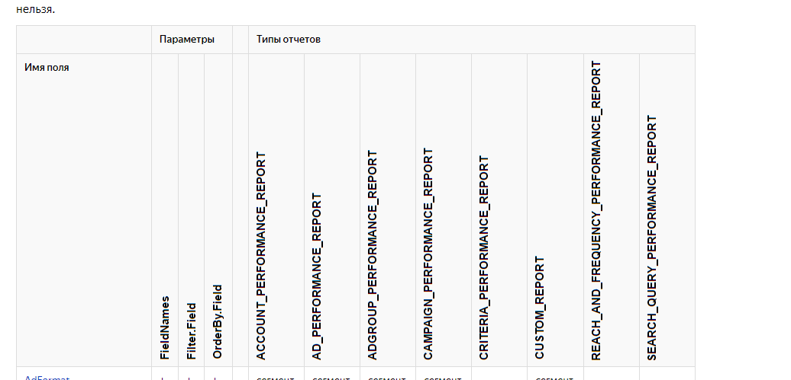
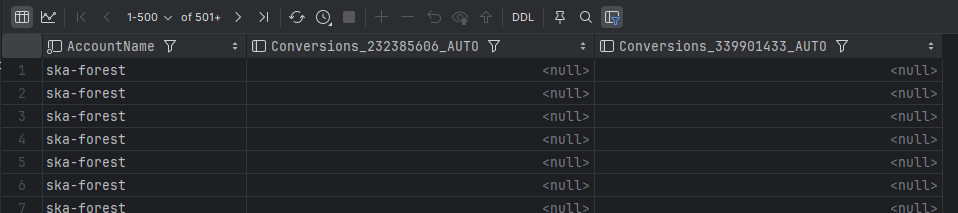

# Создание импорта для аккаунтов Яндекс Директ

Доступные отчеты:
- **Основная статистика** — данные из Мастера отчетов и Поисковых запросов. 
- **Бюджеты** — данные об остатке баланса в аккаунтах.
- **Контент объявлений** - данные о содержании объявлений. 

## Основная статистика
Ссылка на документацию API: [документация](https://yandex.ru/dev/direct/doc/reports/fields-list.html)
Объяснение полей вынесли на отдельную страницу: [поля и их значения](https://yandex.ru/dev/direct/doc/ru/report-format)

Для удобства использования я сохранил оригинальные названия всех параметров, которые нам предлагает API Директа. 

### Подтип отчета
Всего доступно 8 типов отчетов, они отображены в справке API вертикально: 

Обращаю внимание, что для каждого отчета доступны свои поля, например для всех отчетов кроме 
SEARCH_QUERY_PERFORMANCE_REPORT недоступно поле Query (Поисковые запросы). 

Вы можете выбрать только 1 подтип отчета для каждого шаблона импорта.

С полным списком отчетов можете ознакомиться по ссылке выше.

### Поля отчета
По аналогии с Мастером отчетов, где мы выбираем галочками нужные поля - вы можете выбрать в приложении поля для выгрузки. 

Список полей формируется динамически в зависимости от выбранного вами подтипа отчета.

### Модель атрибуции
Вы можете выбрать любое количество моделей атрибуции в шаблоне. 

В конечной таблице для каждой вашей цели будет создан столбец с указанием ID цели и модели атрибуции.

Обратите внимание, что в названии будет указан всегда Conversions, далее идет ID цели 12345678 и дальше - атрибуция AUTO, LYCCD или сокрещние от другой атрибуции.

### НДС
Параметр определяет будет ли добавлен НДС к расходу или нет.

---

## Бюджеты
По умолчанию с помощью шаблона с бюджетами мы можем получить в таблице 2 поля - AccountName и Budget.

### НДС
Параметр определяет будет ли добавлен НДС к балансу аккаунта или нет.

***Внимание!***
По умолчанию в аккаунте Яндекс Директа отображается сумма без НДС, поэтому учтите это при сравнении.

---
## Контент объявлений
Настройка параметров не требуется. 

