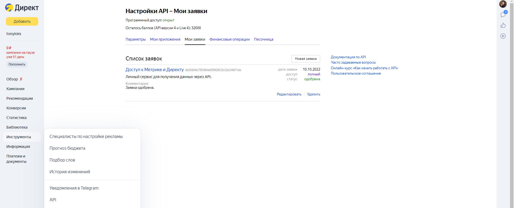
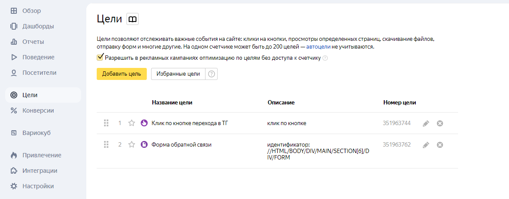

# Создание подключения к аккаунту Яндекс Директ

## Название подключения
**Название подключения** - Название, которое будет использоваться как техническое поле в ваших таблицах. 
На скриншоте вы можете увидеть поле ***AccountName***, которое отличается от логина аккаунта. 
Это есть поле названия подключения, которое будет использоваться в таблицах.

---
## Логин аккаунта
**Логин аккаунта** - Логин аккаунта, который будет использоваться для авторизации в Яндекс Директ без @yandex.ru.

### По типу аккаунта:
- **Обычный аккаунт**: Указывайте свой логин (без @yandex.ru)
- **Управляющий аккаунт**: Указывайте логин конечного аккаунта, откуда необходимо выгрузить статистику
- **Агентский аккаунт**: Указывайте логин конечного аккаунта, откуда необходимо выгрузить статистику  
- **Представительский аккаунт**: Указывайте логин конечного аккаунта, откуда необходимо выгрузить статистику
- **Аккаунт под организацией**: Указывайте логин дочернего аккаунта (без @yandex.ru)

## API-токен доступа
**Токен доступа** - Токен доступа к аккаунту. Этот токен нужен для авторизации в Яндекс Директ.

### Способы получения токена:
1. Получите токен через приложение API Яндекс Директа по [ссылке](https://oauth.yandex.ru/authorize?response_type=token&client_id=db0084b785964e89908f2b32e246f1de)
2. Заведите свое приложение для выдачи токенов в разделе Инструменты - API - Мои заявки - Новая заявка
   
   Укажите цель приложения и подождите около 2-х суток модерацию. 
   Часто модерация отказывает в принятии приложения, поэтому старайтесь описать его как можно подробнее.

### По типу аккаунта:
- **Обычный аккаунт**: Используйте токен своего аккаунта
- **Управляющий аккаунт**: Используйте токен управляющего аккаунта, из под которого вы имеете доступ к конечному
- **Агентский аккаунт**: Используйте токен агентского аккаунта, из под которого вы имеете доступ к конечному
- **Представительский аккаунт**: Используйте токен представительского аккаунта, из под которого вы имеете доступ к конечному
- **Аккаунт под организацией**: Получите токен заново по [ссылке](https://oauth.yandex.ru/authorize?response_type=token&client_id=db0084b785964e89908f2b32e246f1de) и используйте токен от дочернего аккаунта. Приложение имеет доступ для работы с организациями.

## ID целей
**ID целей** - список ID целей, по которым вам нужна информация в статистике. 

Список всех доступных целей можно получить в разделе "Цели" в Яндекс Метрике:

Вам нужно только идентификатор такого типа: ***123321312***

***Внимание!*** 
Вы можете добавить максимум 10 целей в одном подключении. Это связано с ограничениями API Яндекс Директа.