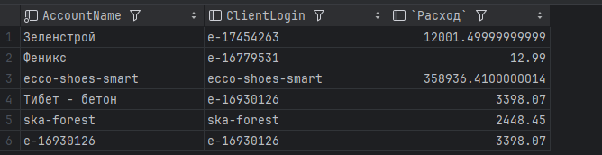

# Создание подключения к аккаунту Яндекс Директ

## Название подключения
**Название подключения** - Название, которое будет использоваться как техническое поле в ваших таблицах. 
На скриншоте вы можете увидеть поле AccountName, которое отличается от логина аккаунта. 
Это есть поле названия подключения, которое будет использоваться в таблицах.

