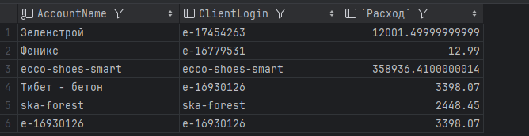
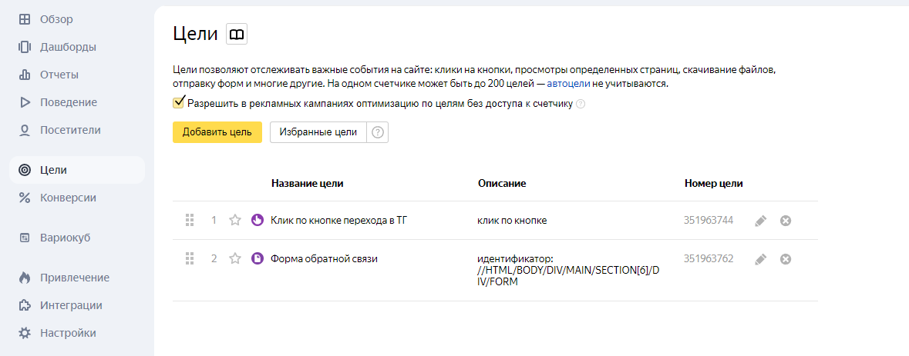

# Создание подключения к аккаунту Яндекс Метрики

## Название подключения
**Название подключения** - Название, которое будет использоваться как техническое поле в ваших таблицах. 
На скриншоте вы можете увидеть поле ***AccountName***, которое отличается от логина аккаунта. 
Это есть поле названия подключения, которое будет использоваться в таблицах.

---
## Номер счетчика
**Номер счетчика** - Номер счетчика, который будет использоваться для авторизации в Яндекс Метрике.

## API-токен доступа
**Токен доступа** - Токен доступа к аккаунту. Этот токен нужен для авторизации в Яндекс Метрике.
Получить токен можно 2-мя способами:
- Получите токен через мое (любое другое) приложение API Яндекс Директа и Метрики, просто переходите по [ссылке](https://oauth.yandex.ru/authorize?response_type=token&client_id=db0084b785964e89908f2b32e246f1de).
- Заведите свое приложение для выдачи токенов по ссылке [ссылке](https://yandex.ru/dev/id/doc/ru/register-client?ysclid=m6qhgzu3mv18865987).

---
**Важно!**

Все перечисленные выше поля позволяют работать с Logs API Метрики, но для работы с Report API необходимо заполнить следующие поля:

---

## Валюта
**Валюта** - Валюта, которая будет использоваться для отчетов.

---

Если вам нужно получать данные по рекламным расходам из Report API Метрики, то вам нужно заполнить следующие поля:

---

## Аккаунт Яндекс Директа
**Аккаунт Яндекс Директа** - логин аккаунта Яндекс Директа (без @yandex.ru).

## ID целей
**ID целей** - список ID целей, по которым вам нужна информация в статистике. 

Список всех доступных целей можно получить в разделе "Цели" в Яндекс Метрике:

Вам нужно только идентификатор такого типа: ***123321312***

***Внимание!*** 
Вы можете добавить максимум 10 целей в одном подключении.

